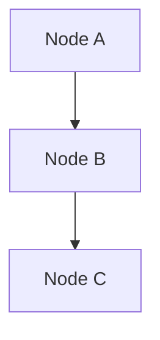
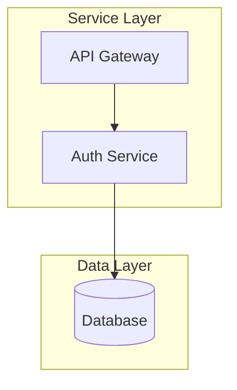
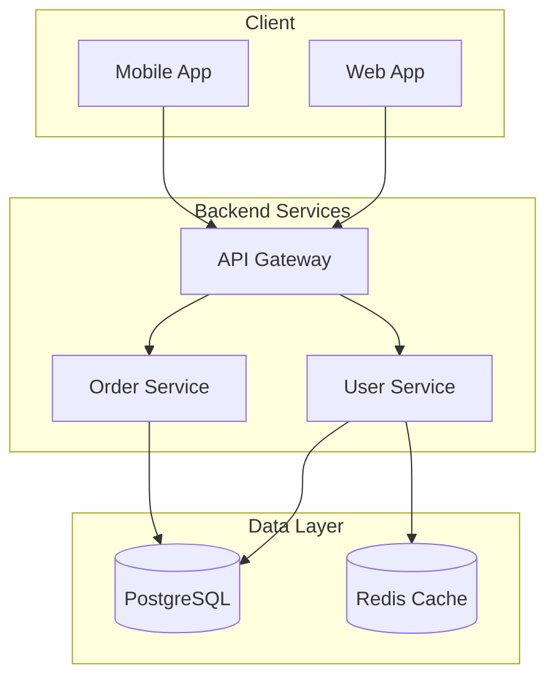
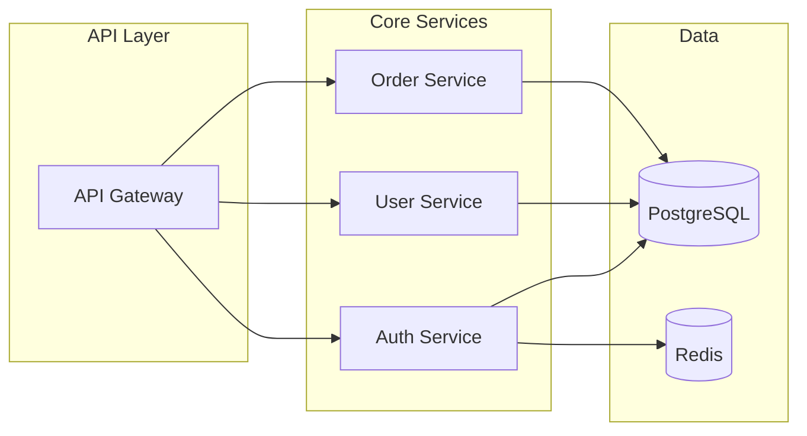

# Create Flowchart/Graph Diagram Skill

## Purpose
Create flowchart and graph diagrams using Mermaid syntax to visualize component relationships, architecture overviews, and process flows.

## When to Use
- User asks to create an architecture diagram
- User wants to show component relationships
- User needs a process flowchart
- User asks to visualize system structure

## Syntax Reference

### Basic Structure

### Direction Options
- `TD` or `TB` = Top to Down/Bottom
- `LR` = Left to Right
- `RL` = Right to Left
- `BT` = Bottom to Top

### Node Shapes
| Syntax | Shape | Use For |
|--------|-------|---------|
| `[text]` | Rectangle | Standard nodes, processes |
| `(text)` | Rounded | Start/end, decisions |
| `[(text)]` | Cylinder | Database, storage |
| `{text}` | Diamond | Decision points |
| `>text]` | Flag | Async processes |
| `((text))` | Circle | Events, triggers |

### Connection Types
| Syntax | Line Type |
|--------|-----------|
| `-->` | Arrow |
| `---` | Line (no arrow) |
| `-.->` | Dotted arrow |
| `==>` | Thick arrow |
| `--text-->` | Arrow with label |

### Subgraphs

## Step-by-Step Process

### 1. Identify Components
- List all entities/components to include
- Determine their types (service, database, client, etc.)
- Map relationships between components

### 2. Choose Direction
- `LR` for horizontal flows (API calls, data pipelines)
- `TD` for hierarchical structures (org charts, layered architecture)

### 3. Organize with Subgraphs
Group related components:
- By layer (presentation, business, data)
- By domain (auth, billing, users)
- By environment (client, server, external)

### 4. Create the Diagram

## Quality Standards
- Quote labels with special characters: `["Label (info)"]`
- Use meaningful node IDs
- Keep diagrams focused (max 15-20 nodes)
- Use subgraphs for organization
- Add descriptive edge labels for clarity

## Example Usage

### Architecture Overview
User: "Create a diagram of our microservices architecture"

